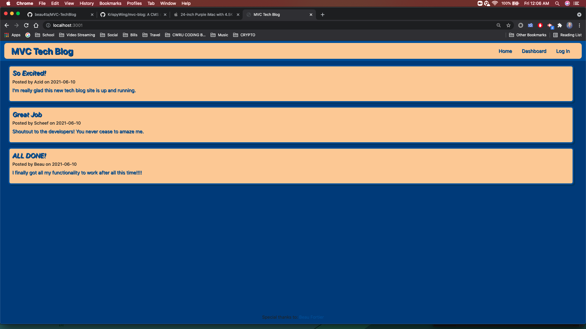
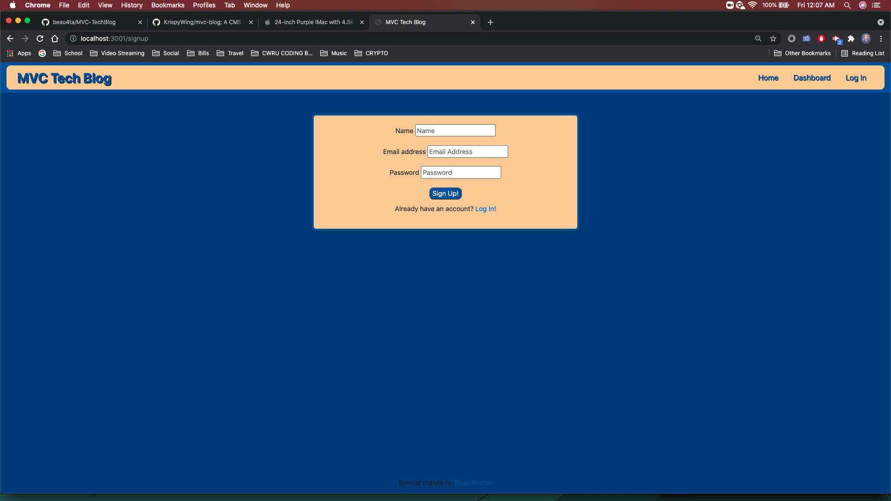
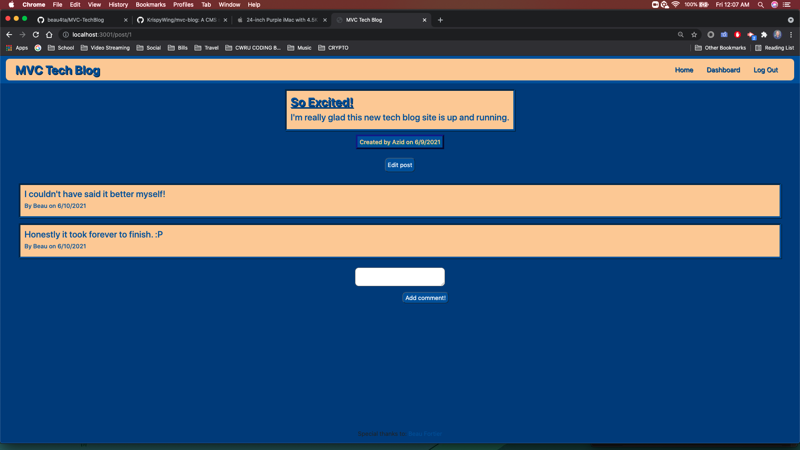
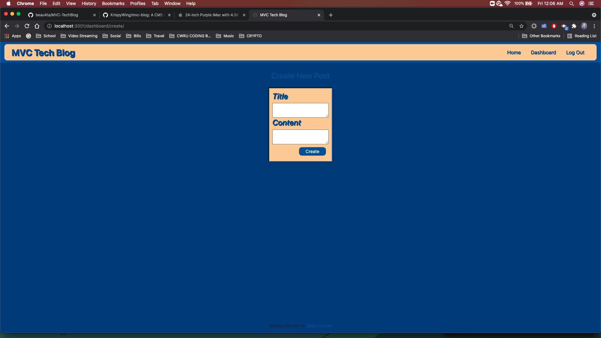
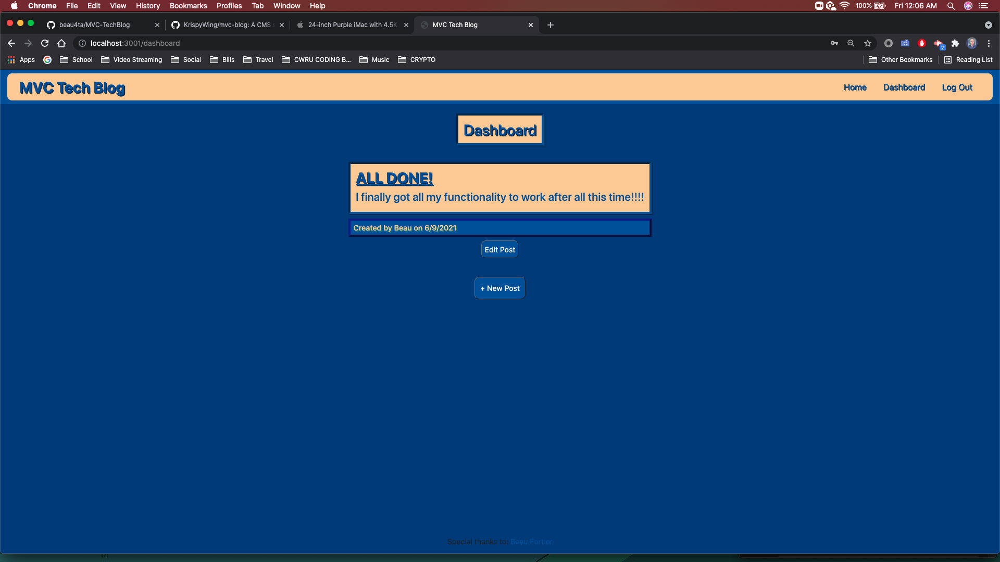
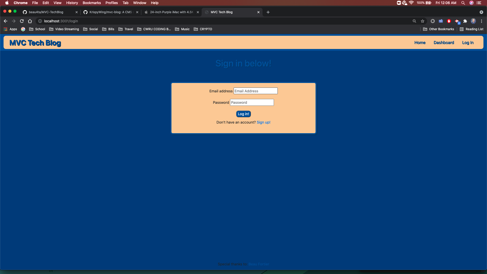

# MVC TechBlog
  
  ## License
  

  ## Description
    ```md
    AS A developer who writes about tech
    I WANT a CMS-style blog site
    SO THAT I can publish articles, blog posts, and my thoughts and opinions
    ```

  ## Table of Contents
  - [Description](#description)
  - [Installation](#installation)
  - [Usage](#usage)
  - [License](#license)
  - [Contributing](#contributing)
  - [Tests](#tests)
  - [Questions](#questions)

  ## Installation
  npm install

  ## Usage
  npm start

  ## License
  N/A
  
  ## Contributing
  Beau Fortier

  ## Tests
  No tests were involved

  ## Questions
  Email me for any questions
  
  GitHub: [beau4ta](https://github.com/beau4ta)
  
  Email: beaufortier13@gmail.com
  
GitHub Repo: https://github.com/beau4ta/MVC-TechBlog

Live Site:






